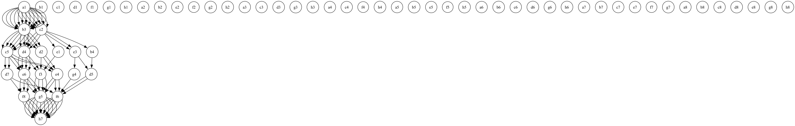

# Knight's Shortest Path Problem

This repository contains a Python solution to the **Knight's Shortest Path Problem**, which calculates all possible shortest paths a knight can take to travel 
from a start position to an end position on a standard 8x8 chessboard. The solution uses **Breadth-First Search (BFS)** to ensure efficiency and correctness.

---

## Table of Contents
- [Problem Description](#problem-description)
- [Features](#features)
- [Example](#example)
- [Directory Structure](#directory-structure)
- [Setup and Usage](#setup-and-usage)
  - [Running with Docker](#running-with-docker)
  - [Using Configurations](#using-configurations)
  - [Command-Line Input](#command-line-input)
  - [Interactive Mode](#interactive-mode)
- [Extensions and Future Enhancements](#extensions-and-future-enhancements)
- [Development Notes](#development-notes)
- [Dependencies](#dependencies)
- [License](#license)

---

## Problem Description
In chess, the knight moves in an "L" shape, meaning it can jump two squares in one direction and one square in a perpendicular direction. 
The challenge is to find **all possible shortest paths** from a given start position to an end position, using the rules of the knight's movement.

## Example
For the start position `a1` and the end position `h7`, the program finds all shortest paths, including:
- **Shortest Paths Output**: Paths are printed in algebraic notation, e.g., `a1 -> c2 -> b4 -> d5 -> f6 -> h7`. And other equivalent shortest paths.
- **Graph Visualization**: Generates a visualization based on matplotlib and a graph image showing all shortest paths (`knight_paths.png`).

### Example Output

Matplotlib visual representation in python:


Output of runningn the program, Graphviz representation:


---

## Features
- Finds **all shortest paths** using **Breadth-First Search (BFS)**.
- Outputs a visual representation of paths using **Matplotlib**.
- Outputs a visual representation of paths using **Graphviz**.
- Configurable start and end positions via CLI or `config.json`.
- Containerized with a `Dockerfile` for ease of deployment.

---

## Directory Structure
```plaintext
knight-shortest-path/
├── config.json            # Configuration file for defining start and end positions
├── dockerfile             # Dockerfile for containerizing the solution
├── knight_tour.py         # Main script implementing the solution
├── knight_paths.png       # Example output showing a graphical visualization of paths
├── requirements.txt       # Python dependencies
└── README.md              # Repository documentation
```

---

## Setup and Usage

### Running with Docker
1. Build the Docker image:
   ```bash
   docker build -t knight-shortest-path .
   ```
2. Run the container:
   ```bash
   docker run --rm -v "$(pwd):/app" knight-shortest-path
   ```

### Using Configurations
You can specify start and end positions in the provided `config.json` file:
```json
{
  "start": "a1",
  "end": "h7"
}
```
Run the script:
```bash
python knight_tour.py --config config.json
```

### Command-Line Input
Run the script and specify positions directly:
```bash
python knight_tour.py --start a1 --end h7
```

### Interactive Mode
Run the program without arguments to input positions interactively:
```bash
python knight_tour.py
```
You will be prompted to enter positions in algebraic notation (e.g., `a1` and `h7`).

---

## Extensions and Future Enhancements

### 1. Heuristic Optimization: Warnsdorff's Rule
The script can be enhanced with Warnsdorff's Rule, a heuristic that prioritizes moves with fewer onward options. This improves the algorithm’s efficiency 
by reducing unnecessary recursive calls, making it faster in finding solutions.

### 2. Generalization
The algorithm can be generalized to support:
- **Custom board sizes**: Extend to chessboards of dimensions other than 8x8 (e.g., NxM).
- **Arbitrary start/end positions**: Allow users to provide any start and end position, with validation to ensure feasibility.

### 3. Visualization
For a better user experience:
- Implement an interactive chessboard for exploring paths and configurations.

### 4. AI and Machine Learning Integration
- Use **Reinforcement Learning** to predict optimal knight paths.
- Generate training data from the current script for machine learning research.

### 5. Obstacles and Dynamic Boards
- Add support for obstacles or restricted squares.
- Modify the algorithm to dynamically navigate around these constraints.

### 6. Cloud Deployment
Deploy the solution as a REST API using **Flask** or **FastAPI**:
- Accept board configurations remotely.
- Return solutions as JSON or visual representations.

---

## Development Notes

### Introduction
The Knight's Tour problem involves moving a knight across a chessboard such that it visits every square exactly once. This Python script implements a 
solution using Breadth-First Search (BFS), ensuring that all minimum-length paths from the starting to the ending position are found. The program includes 
various options for execution, such as through configuration files, command-line arguments, or interactive mode.

### Summary
The current script is a solid foundation for solving the Knight's Tour problem. By adding features like heuristic optimization, visualization, 
machine learning, and cloud deployment, this project can be transformed into a powerful tool for learning, research, and experimentation.

---

## Dependencies
- Python 3.8 or later
- Required Python libraries (see `requirements.txt`):
  - `matplotlib`
  - `graphviz`
  - `argparse`
  - `json`

Install the dependencies with:
```bash
pip install -r requirements.txt
```

---

## License
This project is licensed under the MIT License. See the `LICENSE` file for details.
